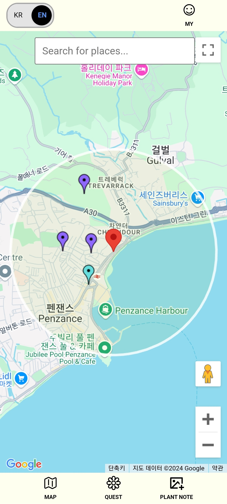
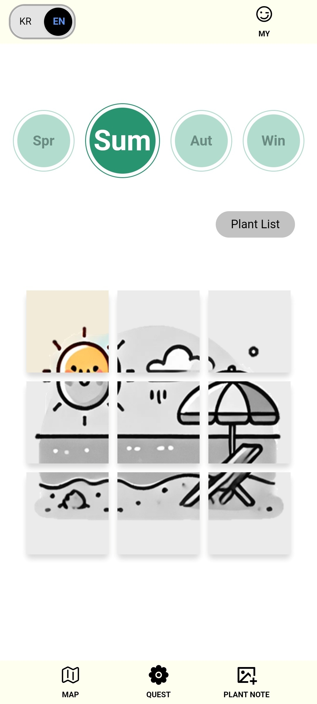
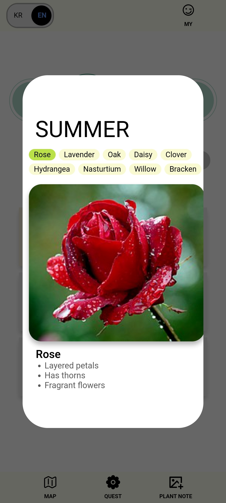
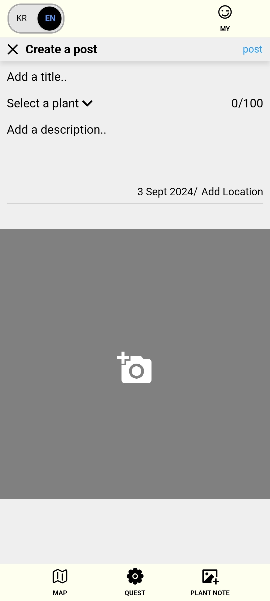

# Plantour

**Explore the Plants in Your Neighborhood!**

- Discover seasonal plants and complete fun missions.
- Record the plants you find around you and share them with other users.
- Check out the plants others have already found on the map.

**우리 동네 식물을 찾아 떠나는 집 앞 탐험!**

- 계절마다 다양한 식물을 찾아 미션을 수행하세요.
- 내 주변에서 발견한 식물을 기록하고, 다른 사용자들과 공유할 수 있어요.
- 지도에서 다른 사용자들이 발견한 식물들을 확인할 수 있어요.
   
   

## Stack

 
 

## Deploy

▶[https://plantour.site/](https://plantour.site/)
 
 

## Develop Period

1st July 2024 ~
 
 

## Member

BE: 최영규
FE: 민예빈
 
 

## App Screenshots

**Home**

  
    
    
  
  

 

**Quest**

 

**Plantour**

